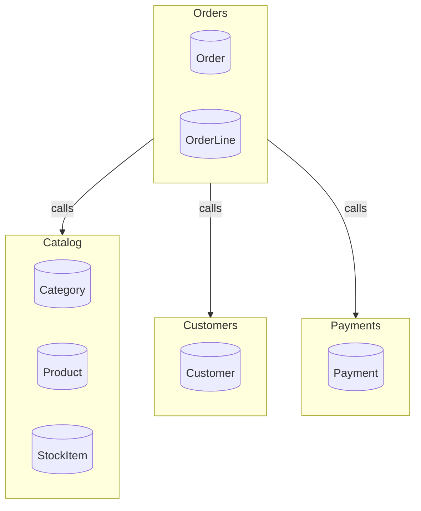

# Architecture — bounded-context services

Each service owns its own schema (database-per-service). Solid edges are
resolved cross-context **sync calls** (typed, resilient `HttpClient`s); a
cross-context **write** is a saga (see `SEQUENCE-DIAGRAMS.md`), never a
chained call.

## Ownership

- **Catalog** owns: Category, Product, StockItem
- **Customers** owns: Customer
- **Payments** owns: Payment
- **Orders** owns: Order, OrderLine

## Why this decomposition

The boundaries follow the monolith's own write-ownership rather than its
folder layout. Catalog **merges** the former `Catalog/` and `Inventory/`
folders: `Product`, `Category` and `StockItem` were only ever mutated
together (a product's stock line has no life of its own), so splitting
inventory out would have created a chatty two-service write for every
stock change — instead the read-check-then-write decrement in
`InventoryService.PlaceOrder` became a guarded atomic `UPDATE` inside one
service. Customers and Payments stayed as their own leaf contexts because
`CustomerService`/`PaymentService` own genuinely independent lifecycles
(identity and good-standing vs. authorisation and settlement) and change
on different cadences from the catalog.

Orders is the deliberate hub, and the coupling we **redesigned** rather
than accepted is the `PlaceOrder` unit of work in `Orders/OrderService.cs`,
which used to commit `Order`, `StockItem` and `Payment` in one
`ShopDbContext.SaveChanges`. Under database-per-service that transaction
cannot span three schemas, so it became the orchestrated `CreateOrder`
saga: validate customer → reserve stock → charge payment **last** as the
pivot, compensating in reverse. The coupling we **accepted** is Orders'
three synchronous read dependencies (customer standing, product pricing,
payment status) — these are reads, not writes, so they are typed resilient
`HttpClient` calls onto `Contracts/` read models, and the EF navigations
that crossed `Order → Product/Customer/Payment` were dropped in favour of
plain ID references.
