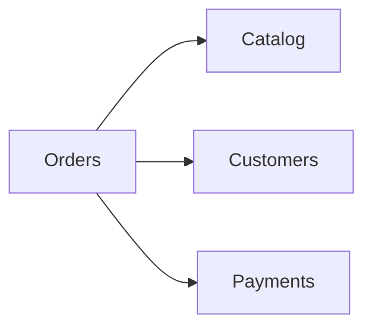

# Cross-context call graph

Resolved synchronous call edges between bounded contexts (typed, resilient
`HttpClient`s via Aspire service discovery + `ServiceDefaults`). A
cross-context **write** does not appear here — it is a saga (see
`SEQUENCE-DIAGRAMS.md`).

