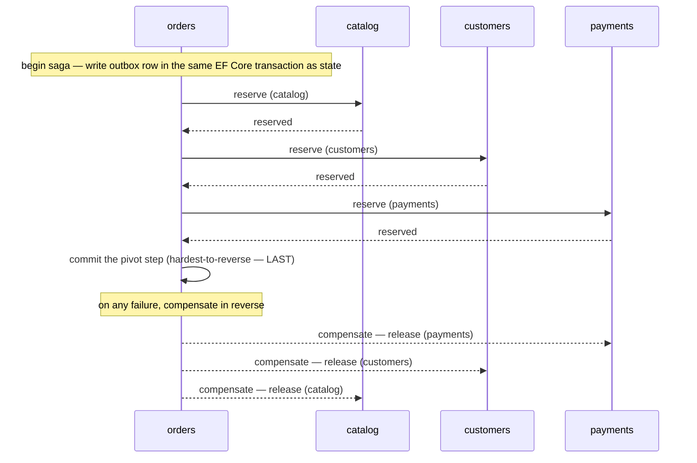

# Sequence diagrams — orchestrated sagas

Each cross-service write is an orchestrated saga via Wolverine (handlers + EF outbox): the
hardest-to-reverse step runs **last** as the pivot; any earlier failure
compensates in reverse. Delivery is at-least-once, so every consumer/handler
is idempotent.

## CreateOrder (orchestrator: `orders`)

